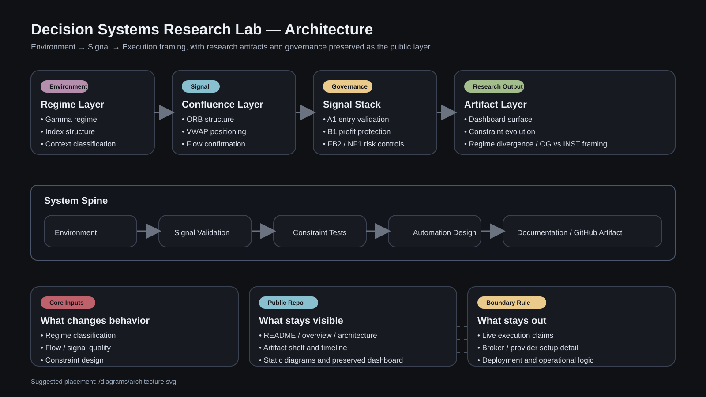
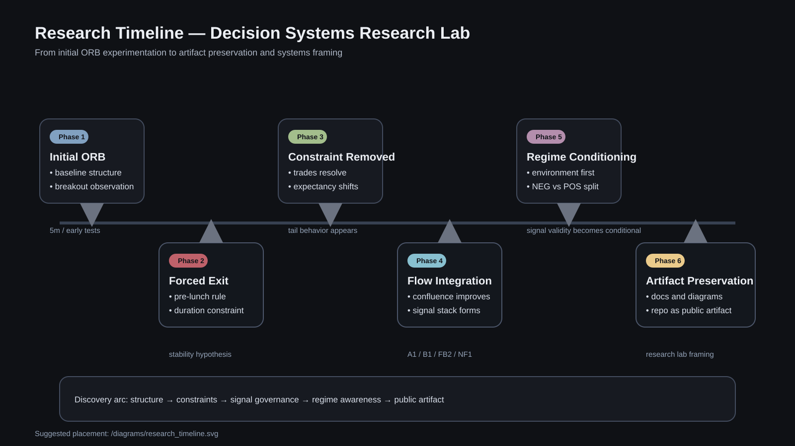

# Diagrams

Visual artifacts supporting research evolution (SVG, GitHub-friendly):

- `architecture.svg` — system overview
- `research_timeline.svg` — discovery progression

Paths below are relative to **this folder** (`diagrams/`). Expand a section to view.

System architecture

Research timeline

If an image does not render in the GitHub preview, open the file directly:  
[architecture.svg](./architecture.svg) · [research_timeline.svg](./research_timeline.svg)
